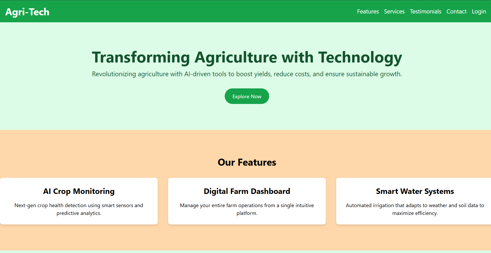
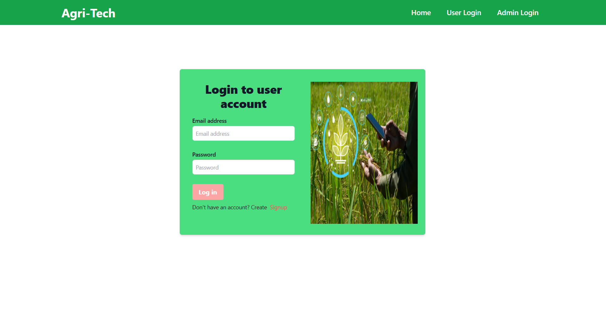
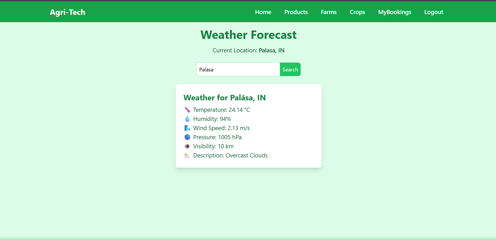
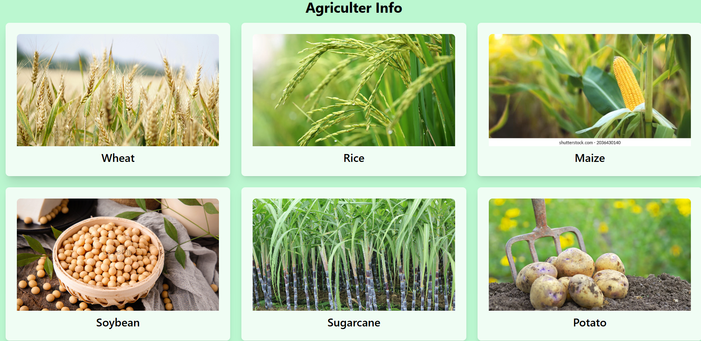
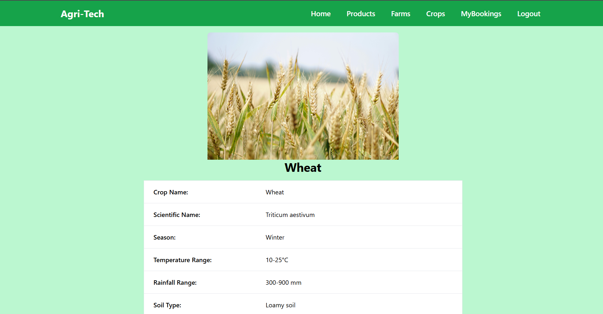
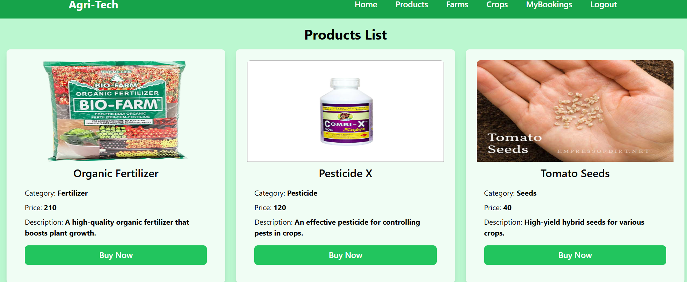
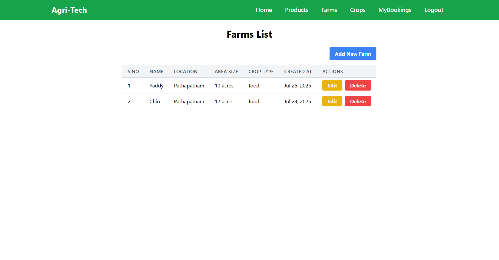
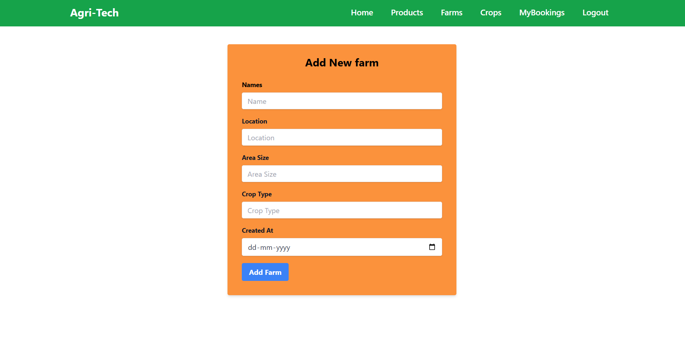

# 🌱 AgriTech – Smart Agriculture Management System

AgriTech is a web-based platform designed to help farmers adopt modern technology for smarter farming.  
It provides crop information, weather forecasting, farm management, and an e-commerce marketplace for agricultural products – all in one place.

---

## 🚀 Features

- **User Authentication**  
  - User & Admin login/signup system.  
  - Secure access to dashboard and farm details.

- **Home Page**  
  - Introduction to AgriTech services.  
  - AI Crop Monitoring, Digital Farm Dashboard, Smart Water Systems.  
  - Real farmer testimonials from across India.

- **Weather Forecast**  
  - Location-based live weather updates.  
  - Details include temperature, humidity, wind speed, pressure, visibility, and cloud description.

- **Crop Information**  
  - List of major crops (Wheat, Rice, Maize, Soybean, Sugarcane, Potato, etc.).  
  - Each crop has detailed information: scientific name, season, temperature, rainfall, and soil type.

- **Farm Management**  
  - Farmers can add, edit, and delete their farms.  
  - Stores farm details: name, location, area size, crop type, and date created.  
  - Digital record-keeping for multiple farms.

- **Product Marketplace**  
  - Browse and purchase agricultural products (fertilizers, pesticides, seeds).  
  - Each product shows name, category, price, description, and image.  
  - “Buy Now” option for seamless shopping.

- **My Bookings (Future Module)**  
  - Track purchased items/orders.  
  - Manage past and current bookings.

---

## 🛠️ Tech Stack

- **Frontend:** HTML, CSS, JavaScript, Bootstrap  
- **Backend:** Node.js / Express.js  
- **Database:** MongoDB (or MySQL if configured)  
- **APIs:** OpenWeather API (for weather data)  
- **Tools:** Git, VS Code

---

## 📸 Screenshots

### 🔹 Home Page


### 🔹 Login Page


### 🔹 Weather Forecast


### 🔹 Crop Information


### 🔹 Crop Details


### 🔹 Products Marketplace


### 🔹 Farm List


### 🔹 Add New Farm


---

## ⚙️ Installation & Setup

1. Clone the repository  
   ```bash
   git clone https://github.com/your-username/agritech.git
   cd agritech
